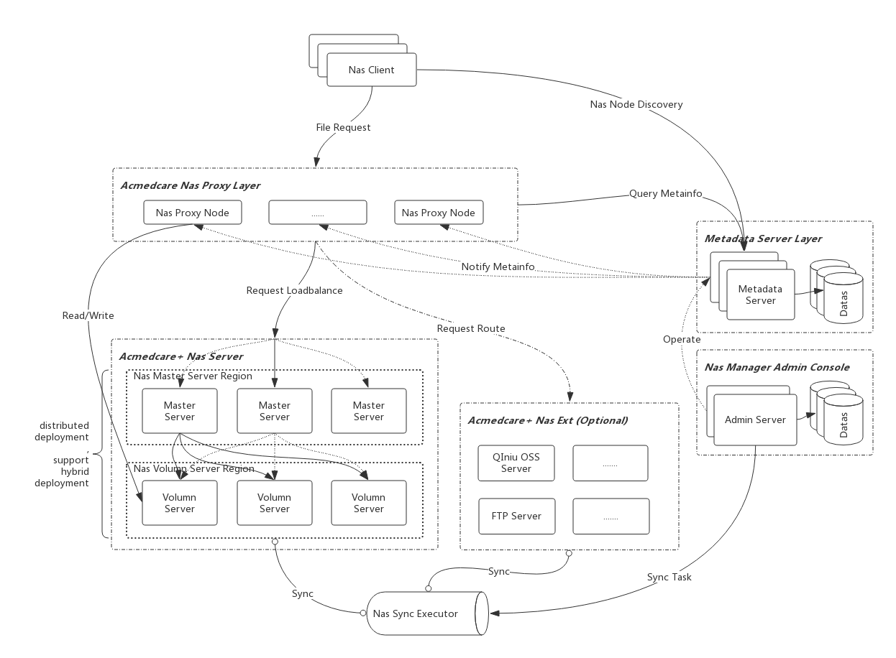

## 🥳Acmedcare-Nas

Acmedcare+ Distribution Storage System

### Architecture



### Environment deployment

#### Download

> 2.1.1.BUILD-SNAPSHOT

----

[Acmedcare Nas Server](releases/2.1.0.BUILD-SNAPSHOT/nas-fs-2.1.0.BUILD-SNAPSHOT-assembly.tar.gz)

[Acmedcare Nas Proxy](releases/2.1.0.BUILD-SNAPSHOT/nas-server-2.1.0.BUILD-SNAPSHOT.tar.gz)

#### Startup
----

- Acmedcare Nas Server

> ignore


- Acmedcare Nas Proxy

```bash
  
  # startup
  ./bin/startup.sh -m daemon

  # shutdown
  ./bin/shutdown.sh

```


### Nas Ext Proxy
Nas Proxy for client to use, current implements:

- [x] Acmedcare Nas OSS  (@see guide [README.md](client/README.md))
- [x] QiNiu OSS (@see guide [README.md](nas-exts/README.md))
- [ ] Aliyun OSS


### Nas Client Api

#### Standalone Java Nas Client 

> Reference Document [Java-Nas-Client](client/README.md)

#### Spring Boot Starter Nas Client

> Reference Document [Spring-Boot-Starter-Nas-Client](spring/nas-client-spring-starter/README.md)

### Building from Source

You don’t need to build from source to use `Acmedcare+ Nas` (binaries in [repo.acmedcare.com](http://47.97.26.165:8081/repository/maven-public/)), 
but if you want to try out the latest and greatest, 
`Acmedcare+ Nas` can be easily built with the maven wrapper. You also need JDK 1.8.

*First* : git clone source from gitlab
 
```bash
$ git clone http://115.29.47.72:8082/acmedback/Acmedcare-Nas.git
```

*Second* : build

```bash
$ mvn clean install
```

If you want to build with the regular `mvn` command, you will need [Maven v3.5.0 or above](https://maven.apache.org/run-maven/index.html).


### License
 
```
Copyright (c) 2019 Acmedcare+

Permission is hereby granted, free of charge, to any person obtaining a copy
of this software and associated documentation files (the "Software"), to deal
in the Software without restriction, including without limitation the rights
to use, copy, modify, merge, publish, distribute, sublicense, and/or sell
copies of the Software, and to permit persons to whom the Software is
furnished to do so, subject to the following conditions:

The above copyright notice and this permission notice shall be included in all
copies or substantial portions of the Software.

THE SOFTWARE IS PROVIDED "AS IS", WITHOUT WARRANTY OF ANY KIND, EXPRESS OR
IMPLIED, INCLUDING BUT NOT LIMITED TO THE WARRANTIES OF MERCHANTABILITY,
FITNESS FOR A PARTICULAR PURPOSE AND NONINFRINGEMENT. IN NO EVENT SHALL THE
AUTHORS OR COPYRIGHT HOLDERS BE LIABLE FOR ANY CLAIM, DAMAGES OR OTHER
LIABILITY, WHETHER IN AN ACTION OF CONTRACT, TORT OR OTHERWISE, ARISING FROM,
OUT OF OR IN CONNECTION WITH THE SOFTWARE OR THE USE OR OTHER DEALINGS IN THE
SOFTWARE.

```
